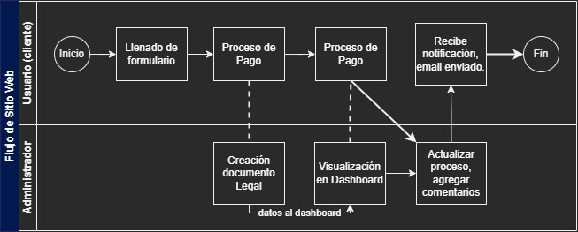
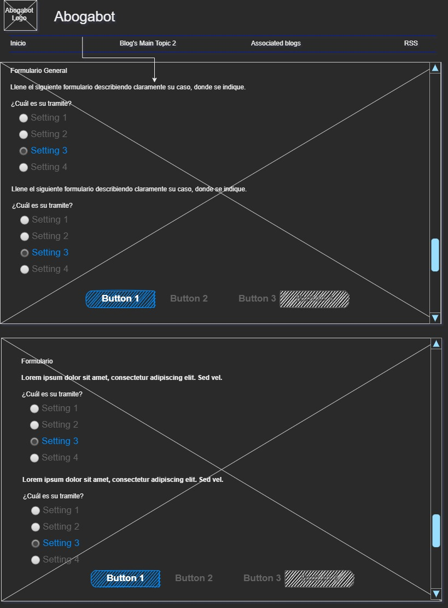
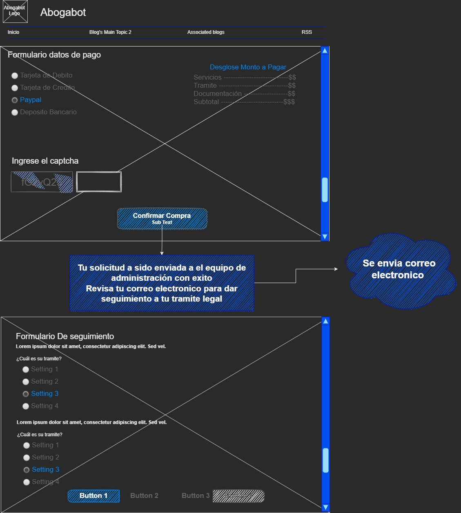
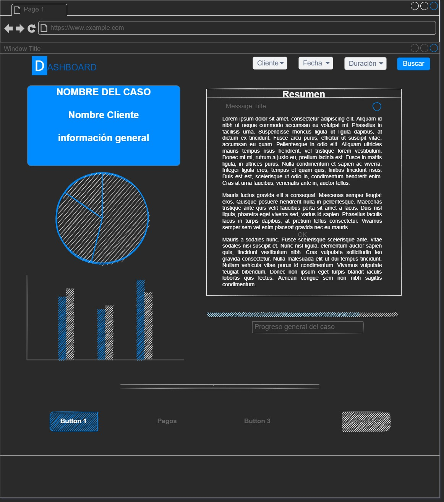

# Practica Wireframe

Para esta practica utilice la siguiente herramienta:

- Miro (https://miro.com/es/) Esta herramienta te permitirá crear flujos de información y flujos de negocio.

<!--
- Balsamic mockups (https://balsamiq.com/wireframes/) Nos da elementos para poder crear interfaces rápidas y que nos dejan representar la idea.
- Dibujos a mano alzada a veces un wireframe también puede ser en una servilleta o en cualquier forma escrita.
-->

<!-- Y puedes revisar el live del jueves 17/02/22  https://web.microsoftstream.com/video/9bcebbbb-a07a-4ffe-a4b8-3e9ad0c6b5e8
-->

## Creacion de flujo de negocio

Utilizando la herramienta de app.diagrams.net cree este diagrama de flujo del sitio web

## Creacion de Wireframes

De igual forma cree un pequeño wireframe de las paginas del sitio web en (https://www.diagrams.net)

> Pagina principal de Abogabot

> Apartado de pago cliente

> Apartado de Dashboard

**_¡Vámonos hasta el espacio y más allá Explorers!_**
